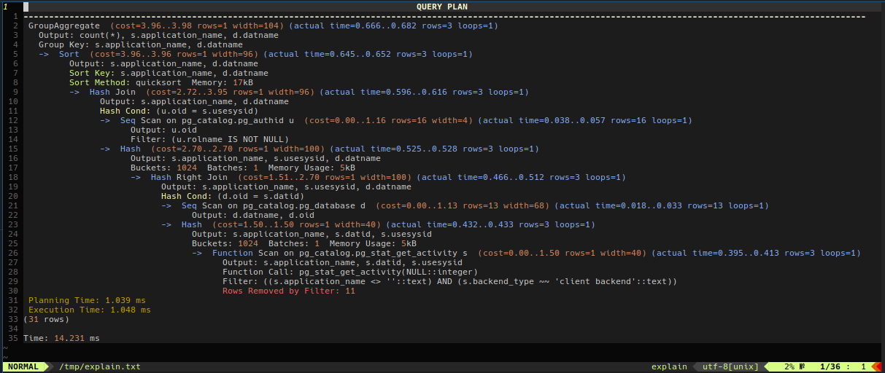

# Vim-PG-Explain-Syntax
Syntax highlighting for PostgreSQL EXPLAIN output

## Syntax
This syntax highlighting will assist in reading PostgreSQL EXPLAIN output.

It is similar to the syntax highlighting found on various tools, such as
[Depesz's Explain Tool](https://explain.depesz.com/)

## Installation
Copy/merge the included folders to your $VIM folder.

For per-user basis, this is typically `~/.vim/`

For system-wide, this is typically `/usr/share/vim/vimfiles/`

## Usage

Because there is no 'defined' filetype for EXPLAIN output, Vim has no way to
detect this type of file.

You can enable the syntax highlighting by using `:setfiletype explain`
after opening the file containing the EXPLAIN plan
